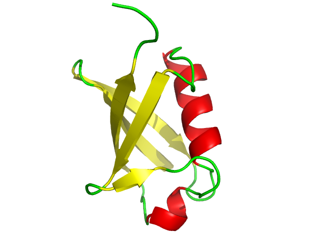

# Del ADN a la proteína

**Introducción.** El ADN almacena la información genética. La replicación la copia, la transcripción produce ARN y la traducción convierte la información del ARNm en una cadena de aminoácidos. Los seis ejercicios de la guía permiten recorrer estos procesos y relacionar la secuencia con la estructura de las proteínas.

## Ejercicio 1. Replicación del ADN

**Objetivo:** comprender la replicación semiconservativa y las enzimas implicadas.

1. **Secuencia inicial.** Las hebras son `5'-ATGCCGTTAGCT-3'` y `3'-TACGGCAATCGA-5'`. Se emparejan A con T y C con G; las hebras son complementarias y antiparalelas.
2. **Una ronda de replicación.** La primera molécula hija conserva la hebra superior y fabrica `3'-TACGGCAATCGA-5'`; la segunda conserva la hebra inferior y fabrica `5'-ATGCCGTTAGCT-3'`. Cada hija tiene una hebra antigua y otra nueva, de ahí el nombre *semiconservativa*. La helicasa separa las hebras; la primasa coloca cebadores de ARN; la ADN polimerasa añade nucleótidos complementarios en dirección 5' a 3'; y la ligasa une los fragmentos de ADN.
3. **Error no corregido.** Si la ADN polimerasa coloca una base equivocada y el error permanece, en una replicación posterior puede convertirse en una mutación. Según dónde ocurra, podría no tener consecuencias o alterar una proteína.

*Extensión con Biopython.* Para cualquier cadena de ADN, la regla A–T y C–G permite obtener su complementaria. Aplicada a `ATGCCGTTAGCT`, da `TACGGCAATCGA`, igual que el cálculo manual.

## Ejercicio 2. Transcripción del ADN a ARN

**Objetivo:** obtener el ARNm a partir de la cadena molde.

1. **Secuencia inicial.** `5'-ATGCCTGAATGC-3'` / `3'-TACGGACTTACG-5'`.
2. **Cadena molde.** Es la inferior, `3'-TACGGACTTACG-5'`. La ARN polimerasa la lee de 3' a 5' para fabricar ARN en sentido 5' a 3'. La superior es la codificante.
3. **Transcrito.** Frente a T se incorpora A; frente a A, U; y C y G se emparejan entre sí. El resultado es `5'-AUG CCU GAA UGC-3'`. También puede obtenerse tomando la hebra codificante y sustituyendo sus T por U.
4. **Promotor y región codificante.** `ATG` señala un posible comienzo de traducción en la hebra codificante. El promotor es una región donde se inicia la transcripción, normalmente situada antes del gen; **no aparece en el fragmento proporcionado** y no puede identificarse solo por `ATG`.

*Extensión con Biopython.* En una secuencia FASTA de ADN, la orientación importa: la hebra codificante transcrita da el mismo ARNm que la complementaria de la hebra molde; leer la molde en el sentido equivocado da una secuencia distinta.

## Ejercicio 3. Traducción del ARNm a proteína

**Objetivo:** leer los codones y relacionar mutaciones con sus posibles efectos.

1. **ARNm inicial.** `5'-AUG UAU GCU UAA-3'`. Cada grupo de tres bases es un codón.
2. **Inicio y paro.** `AUG` es el codón de inicio; `UAA` es el de paro.
3. **Traducción.** `AUG` codifica metionina (Met), `UAU` tirosina (Tyr) y `GCU` alanina (Ala). El péptido es **Met–Tyr–Ala** (`MYA`); `UAA` no añade ningún aminoácido.
4. **Mutaciones.** Si el inicio `AUG` cambiara a `GUG`, el ribosoma podría no reconocer el comienzo y no producir la proteína. En algunas bacterias `GUG` también puede actuar como inicio. Si desapareciera `UAA`, la traducción continuaría hasta encontrar otro codón de paro y la cadena podría ser más larga.

*Extensión con Biopython.* La traducción de `AUGUAUGCUUAA` da `MYA`, igual que la lectura codón por codón.

## Ejercicio 4. Splicing alternativo

**Objetivo:** entender cómo un gen puede dar lugar a varios productos.

1. **Gen inicial.** Está formado por los exones `1-2-3-4-5`. Los exones se conservan en el ARN maduro después de eliminar los intrones.
2. **Dos combinaciones.** Se proponen `1-2-3-4-5` y `2-4-5`. La segunda omite los exones 1 y 3.
3. **Proteínas resultantes.** Los dos ARNm son diferentes y podrían originar proteínas con regiones y funciones distintas. No basta con contar exones para saber su tamaño: si falta la señal de inicio o cambia el marco de lectura, puede que una combinación no produzca proteína.
4. **Diversidad proteica.** Al combinar de distintas maneras los exones de un mismo gen, la célula obtiene varios transcritos sin necesitar más genes.

*Extensión con bases de datos.* En la consulta de *FGFR2* (`ENSG00000066468`) a Ensembl se observaron 59 transcritos; algunos codifican productos de 821 o 822 aminoácidos y otros no tienen proteína anotada. El número depende de la versión de la base de datos. Las diferencias de exones pueden modificar los dominios y, por tanto, la función de la proteína [3].

## Ejercicio 5. Introducción a las proteínas

**Objetivo:** relacionar secuencia, estructura y función.

1. **Secuencia inicial.** `Met-Ile-Ser-Gly-Val-Lys-His`.
2. **Extremos.** El extremo N está en la metionina (Met) y el extremo C en la histidina (His); las proteínas se escriben habitualmente de N a C.
3. **Orden y mutación.** La sucesión de aminoácidos determina qué grupos pueden interactuar y cómo se pliega la cadena. En una proteína soluble, cambiar un aminoácido hidrofóbico del interior por uno hidrofílico podría desestabilizarla y alterar su función. El resultado concreto depende de la posición y del aminoácido nuevo.

*Extensión con bioinformática.* La ubiquitina de la entrada PDB `1UBQ` tiene una hélice alfa y una lámina beta mixta de cinco hebras. Su núcleo hidrofóbico ayuda a mantener la estructura; una mutación puntual en esa zona podría afectar al plegamiento [4].

*Figura 1. Estructura de ubiquitina (PDB 1UBQ): hélices en rojo y hebras beta en amarillo. Imagen: Lijealso, CC BY 3.0 [5].*

## Ejercicio 6. Actividad integradora

**Objetivo:** seguir la información desde el ADN hasta la proteína.

1. **Secuencia elegida.** Se utilizó el gen *lacZ* de *E. coli* K-12 MG1655, obtenido de `NC_000913.3` en formato FASTA. Su hebra codificante tiene 3075 nucleótidos: `5'-ATGACC...TAA-3'` [2].
2. **Replicación.** Una nueva hebra es la complementaria de la codificante, `3'-TACTGG...ATT-5'`; la otra es una copia de la codificante, `5'-ATGACC...TAA-3'`. Cada molécula hija recibe además una hebra original.
3. **Transcripción.** La hebra molde se lee de 3' a 5' y genera el ARNm `5'-AUGACC...UAA-3'`.
4. **Traducción.** El ARNm contiene 1025 codones, incluido el de paro. Por ello se obtiene una proteína de **1024 aminoácidos**, cuyo comienzo es `MTMITD...`; `UAA` no se traduce.
5. **Errores.** Un error de replicación que quede fijado en el ADN puede transmitirse y afectar a muchas transcripciones posteriores. Los errores de transcripción o traducción suelen limitarse a moléculas concretas, por lo que aquí la replicación es el punto con consecuencias más duraderas.
6. **Proceso completo.** El flujo empieza leyendo la secuencia FASTA, calcula la complementaria para representar la replicación, obtiene el ARNm de la hebra molde y traduce sus codones hasta el primer paro. En cada etapa se informa del producto obtenido.

*Extensión con Biopython.* El mismo flujo puede automatizarse para mostrar sucesivamente las dos nuevas hebras, el ARNm y la proteína; los resultados anteriores permiten comprobar cada etapa.

## Referencias

1. Guía docente, *Del ADN a la proteína*, ejercicios 1–6.
2. [NCBI Gene, *lacZ*, Gene ID 945006](https://www.ncbi.nlm.nih.gov/gene/945006).
3. [Ensembl, *FGFR2*, ENSG00000066468](https://www.ensembl.org/Homo_sapiens/Gene/Summary?g=ENSG00000066468).
4. [RCSB PDB, *Ubiquitin*, entrada 1UBQ](https://www.rcsb.org/structure/1UBQ).
5. [Lijealso, *Ubiquitina.png*, Wikimedia Commons, CC BY 3.0](https://commons.wikimedia.org/wiki/File:Ubiquitina.png).
